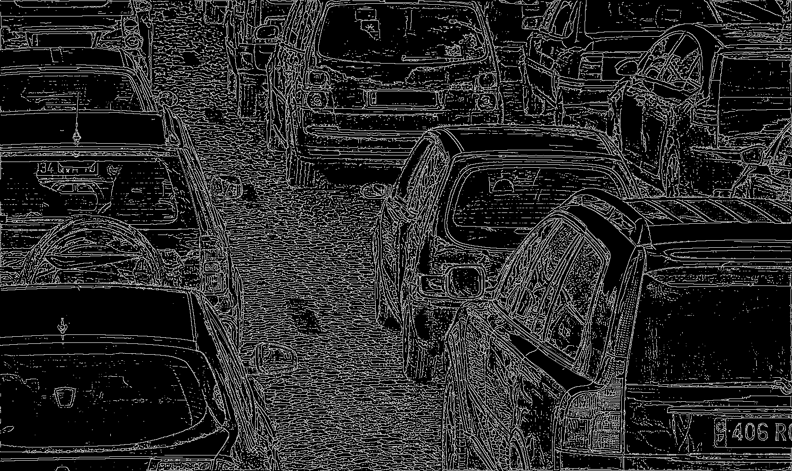
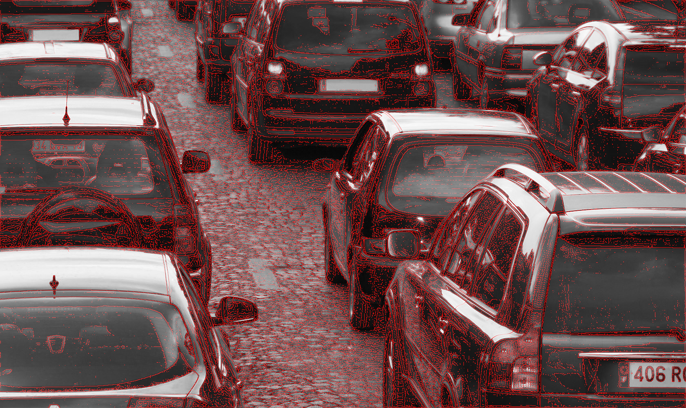

# PJI README

- Baas Simon
- Meinas Julien

---

# Projet

## Installation du projet

Les différentes étapes concernant l'installation du projet se trouvent dans le fichier Install.markdown.

## Les différents scripts du projet

- image_resize.py

Permet de redimensionner une image.

- tensorflow/models/research/object_detection/object_detection_tutorial_TF1_EDIT.py

Lance la détection d'objets sur les images de test présentes dans le répertoire test_images.

- tensorflow/models/research/object_detection/object_detection_with_cv2_TF1_EDIT.py

Lance le même algorithme mais en l'adaptant à OpenCV (vidéo, webcam, caméra).

## Execution des scripts

- python object_detection_with_cv2_TF1_EDIT.py --timer 5 --width 800 --duration 100

- python object_detection_with_cv2_TF1_EDIT.py

---

## Installation des librairies

Le projet nécessite l'installation de différentes librairies python.
Les installations de celles ci sont décritent dans le fichier Install.markdown

---

## Questions à se poser

##### Comment ces outils peuvent traiter un flux vidéo ?

> La gestion du flux vidéo est géré par la célèbre librairie OpenCV. (cf Segmentation et détection...)

Il est possible  de charger des vidéos avec OpenCV, avec notamment par exemple, la fonction VideoCapture

##### Sont-ils capables de traiter un flux en temps réel, mini 10Hz) ?

On peut aussi capturer en direct, par exemple avec une webcam, via la fonction VideoCapture. On peut aussi enregistrer des vidéos/images.

##### Valider l'environnement de développement, Windows ou Linux.

Nous utiliserons Linux comme environnement de développement, afin de faciliter l'installation des différentes librairies et l'utilisation des différents frameworks.

##### Trouver une librairie d'image adaptée contenant différents types de véhicules.

Pour le moment c'est la librairie Coco qui semble être la plus utilisée sur les différents code Open Source trouvés. Afin de l'utiliser il est nécessaire d'installer l'API Coco.

##### Trouver un algorithme Open Source permettant de tester/entraîner une librairie d'image.

Confère fichier Intall.markdown pour l'installation.

---

## Dataset

#### Liens vers différents dataset

http://homepages.inf.ed.ac.uk/rbf/CVonline/Imagedbase.htm

https://downloads.greyc.fr/vedai/

#### Utilisation du dataset

https://gilberttanner.com/blog/creating-your-own-objectdetector

---

### Documentation, frameworks pour détection d'objets

##### TOP 10 - Traitement d'images en Python

https://moncoachdata.com/blog/10-outils-de-traitement-dimages-en-python/

#####  API Google en TensorFlow

https://www.actuia.com/actualite/google-publie-open-source-nouvelle-api-de-detection-dobjets-tensorflow/

En ce qui concerne l'API, celle ci est déjà implémenté dans les produits comme NestCam, Recherches d'images ou encore Street View.

##### Caractéristiques des différents frameworks

https://www.developpez.com/actu/239178/Microsoft-propose-ML-NET-un-framework-d-apprentissage-automatique-open-source-qui-rend-l-apprentissage-automatique-accessible-aux-developpeurs-NET/

Au niveau des frameworks il en existe 3 principaux, TensorFlow, PyTorch et ML.NET.

Pour ML.NET, il suit la logique des langages .NET. C'est donc un framework Microsoft qui va pouvoir s'intégrer aux projets .NET soit des projets écrits en C#

TensorFlow, framework de Google. Le principal langage de programmation de TensorFlow est le Python, mais le C++ et le Java sont également pris en charge.
TensorFlow dispose de nombreux didacticiels, documents et projets.

PyTorch, framework de Facebook, successeur de Torch. Basé sur Python, exploite les principaux packages Python tels que NumPy. Plus simple de créer des algorithmes complexes comme un réseau de neurones récurrent.

##### Vidéos afin de comprendre TensorFlow

 https://www.youtube.com/watch?v=wh7_etX91ls
 https://towardsdatascience.com/how-to-train-your-own-object-detector-with-tensorflows-object-detector-api-bec72ecfe1d9

##### Reconnaissance d'objet avec OpenCV et Raspberry-pi

https://www.framboise314.fr/i-a-realisez-un-systeme-de-reconnaissance-dobjets-avec-raspberry-pi/

##### OpenCV

OpenCV est un framework graphique libre spécialisée dans le traitement d'images en temps réel. Plusieurs traitement sur les images sont possibles. On peut lire, ecrire ou bien afficher une image. Lisser ou filtrer une image.
Il a aussi une partie traitement vidéo. Tout comme les images, on peut lire, écrire et afficher une vidéo, soit depuis un fichier soit directement via une caméra. Dans le traitement vidéo nous avons la possibilité de détecter des visages grâce à la méthode de Viola et Jones. OpenCV possède aussi quelques algorithmes d'apprentissages. OpenCV dipose aussi de quelques fonctions d'interfaces graphiques.

##### Apprendre OpenCV

https://riptutorial.com/Download/opencv-fr.pdf

---

### Librairies d'images

##### Libraire Coco (API Python et Librairie d'images)

https://github.com/cocodataset/cocoapi

API utilisée dans la plus part des projets

##### Site de Coco

http://cocodataset.org/#home

##### Librairie ImageNet

http://image-net.org/

---

### GitHub, code Open Source

##### Code Open Source TensorFlow  (série de modèles pré-entraînés)

https://github.com/tensorflow/models/tree/master/research/object_detection

##### Code Open Source  utilisant Phase Stretch Transform (PST)

https://github.com/JalaliLabUCLA/Image-feature-detection-using-Phase-Stretch-Transform

https://medium.com/@kananvyas/obstacle-detection-and-navigation-through-tensorflow-api-943728c33243

##### Détection objets avec OpenCV

https://github.com/xsyann/detection

Algorithme basé uniquement sur la reconnaissance des visages. Peut être possible de changer les images pour l'apprentissage.

##### GitHub Lidar_Obstacle_Detection

https://github.com/udacity/SFND_Lidar_Obstacle_Detection
https://github.com/studian/SFND_P1_Lidar_Obstacle_Detection

- https://github.com/ajimenezh/self-driving-car-obstacle-detector

- https://github.com/alirezaasvadi/ObstacleDetection

---

### Documents intéressants pour le projet :

##### Mobileye Technology

Leader dans le développement de technologies pour assistance dans la conduite.

Mobileye prend en charge une suite complète de fonctions ADAS, AEB, LDW, FCW, LKA, LC, TJA.

ADAS (Advanced Driver Assistance Systems) Basé sur un spectre passive/active.
Un système passif alerte le conducteur d'un danger potentiel. Ainsi le conducteur peut effectuer une action afin de corriger l'erreur.
Par exemple :

- LDW (Lane Departure Warning) Avertissement de sortie de voie. Avertit le conducteur d'un départ de voie involontaire

- FCW (Forward Collison Warning) Avertissement de collision avant. Indique dans la dynamique actuelle par rapport au véhicule qui précède, une collision est imminente. Le conducteur doit freiner pour éviter la collision.

Au contraire, les systèmes de sécurité actif prennent la main.
AEB (Automatic Emergency Baking) Freinage d'urgence automatique, identifie la collision et les freins imminents sans aucune intervention du conducteur.
ACC (Adaptive Cruise Control) Régulateur de vitesse adaptatif.
LKA (Lane Keeping Assist) Assistant de maintien de voie.
LC (Lane Centering) Le centrage de voie.
TJA (Traffic Jam Assist) Assistant d'embouteillage.
TSR (Traffic Sign Recognition).
IHC (Intelligent High-beam Control).
Toute ces fonctions sont pris en charge à l'aide d'une seule caméra montée sur le pare-brise.

Mobileye possède un système d'avertissement qui peut être installé sur n'importe quel véhicule existant.
Mobileye se base uniquement sur les caméras.

Autonome, défi de détection :
- Espace libre, déterminer la zone de conduite
- Chemin de circulation, la géométrie des itinéraires dans la zone de conduite
- Objets en mouvement, tous les usages de la route dans la zone ou le chemin carrossable
- Sémantique des scène, vaste vocabulaire des indices visuels comme les feux de circulation et leur couleur, panneaux de signalisation, clignotants, direction du regard des piétons, marquages routiers.

##### Deep Multi-modal Object Detection and Semantic Segmentation for Autonomous Driving

https://arxiv.org/pdf/1902.07830.pdf

##### Méthode de Viola et Jones

https://fr.wikipedia.org/wiki/M%C3%A9thode_de_Viola_et_Jones

##### Le modèle ONNX

https://docs.microsoft.com/fr-fr/dotnet/machine-learning/tutorials/object-detection-onnx

ONNX (Open Neural Network Exchange) est un format open source pour les modèles IA. ONNX prend en charge l'interopérabilité entre les frameworks. On peut donc entraîner un modèle dans l'un des nombreux frameworks (K, ML.NET, PyTorch, ...). On peut donc par exemple passer de PyTorch à ML.NET en consommant le modèle ONNX.

##### Le site ONNX

https://onnx.ai/

A noter que le Framework/Converter supporte PyTorch, TensorFlow et beaucoup d'autre framework opensource.
En fonction du framework/outil utilisé, la procédure pour convertir le projet au format ONNX est différente. Les informations concernant cette procédure sont décrites ici : https://github.com/onnx/tutorials#converting-to-onnx-format

##### Tuto : Construire un modèle de reconnaissance de produits sur mesure avec TensorFlow

https://artefact.com/fr-fr/news/comment-utiliser-tensorflow-et-ses-ressources-open-source-pour-construire-un-modele-de-reconnaissance-de-produit-sur-mesure/

##### Niveaux d'autonomie du véhicule autonome

https://www.nhtsa.gov/technology-innovation/automated-vehicles-safety

##### Jupyter Notebook de Google

 https://colab.research.google.com/notebooks/intro.ipynb#recent=true

##### Cours de Christian Wolf INSA Lyon

 https://perso.liris.cnrs.fr/christian.wolf/teaching/

##### Thèse intéressante sur la détection d'obstacles

https://tel.archives-ouvertes.fr/tel-00685828/file/These_Mario_Ibarra_finale.pdf

##### Segmentation et détection d'objets en temps réel avec Tensorflow

https://www.actuia.com/contribution/jeancharlesrisch/segmentation-et-detection-dobjets-en-temps-reel-avec-tensorflow/
